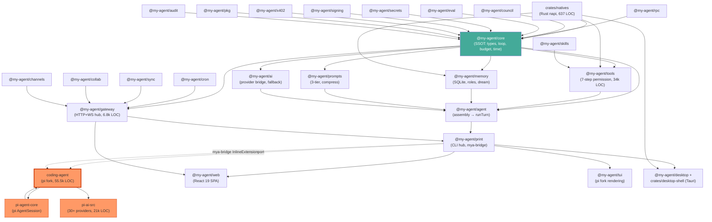

# MYA Deep Analysis

> **Root:** `/home/bom/source/my-agent`
> **Mode:** READ-ONLY (no source files modified)
> **Scope:** `packages/` (32 TS packages) + `crates/` (3 Rust crates)
> **References:** `source/` (12–16 projects, SPEC inputs only — not analyzed as product)
> **Date:** 2026-07-27

---

## (a) Executive Summary

`mya` is a **unified autonomous + coding agent** built from a 25-section SPEC synthesized from 12+ reference projects. The product is a TypeScript monorepo (32 workspace packages, ~182k LOC) with Rust crates providing FFI acceleration (`natives`) and a Tauri desktop shell (`desktop-shell`).

**Headline findings:**

1. **The SPEC-compliant core is real, tested, and faithful** — §4 loop FSM, §5 3-tier prompt system, §7 7-step permission pipeline, §8 memory roles, §10 budget tree, §18 invariants are all implemented and verified in the mya-native packages (`core`, `agent`, `tools`, `memory`, `prompts`, `ai`).

2. **Two parallel agent loops coexist** (🟢 by-design Low — *re-assessed*) — The mya-native `runTurn` FSM (§4) and the pi-forked `AgentSession` run as independent engines. The **dominant user-facing surface** (interactive TUI, gateway sessions) runs on the pi-forked loop; the SPEC-compliant `runTurn` is used by one-shot/print + RPC. **Owner-confirmed: intentional pi-core parity, NOT a bypass.** Nuance: the mya-bridge registers `tool_call` for audit-logging only (no block), so mya-specific guarantees (DangerFullAccess-always-escalates, ask-rules-inviolable) are absent on TUI/gateway by deliberate trade-off.

3. **Security posture is strong and multi-layered** — constant-time wsToken comparison, CSRF Origin check, `DangerFullAccess` always-escalates, fail-closed secrets, tamper-evident Merkle audit log, cron prompt-injection scanner (17 patterns), injection scanner on all inbound channel messages.

4. **Test coverage is excellent overall** (~540 files, ~5,370 tests) but uneven: `memory` (707 tests), `coding-agent` (~166 inherited tests), `tools` (60 files) are well-covered; `natives` (1 TS file, 0 Rust `#[test]`), `desktop-shell` (0 Rust tests), and 15 of 28 web pages are thin.

5. **§18 invariants are genuinely held** — verified: zero `process::exit` in Rust natives (`#![deny(clippy::exit)]`), `Date.now()` confined to test files + browser-side, `@earendil-works` references only in `coding-agent/install-lock` (not in product packages), core has zero upward imports.

---

## (b) Architecture Map + Package Dependency Graph

### High-Level Topology

```
                          ┌─────────────────────────────────┐
                          │     @my-agent/core (SSOT)        │
                          │ types·loop·budget·time·threat    │
                          │ canonical-json·telemetry·spill   │
                          └──┬──────┬──────┬──────┬──────┬───┘
                             │      │      │      │      │
                     ┌───────▼┐ ┌──▼──┐ ┌─▼──┐ ┌▼───┐ ┌▼──────┐
                     │prompts │ │tools│ │ ai │ │mem │ │secrets │
                     │(3-tier)│ │(perm│ │(prov│ │ory │ │        │
                     └───┬────┘ └──┬──┘ └─┬──┘ └─┬──┘ └────┬───┘
                         │         │      │      │         │
                     ┌───▼────┐ ┌──▼──┐ ┌─▼──┐ ┌─▼──┐ ┌───▼───┐
                     │council │ │appr │ │keys│ │dream│ │audit  │
                     │hindsight││ovl  │ │rot.│ │cycle│ │trust  │
                     └────────┘ └─────┘ └────┘ └─────┘ └───┬───┘
                                                         │
          ┌──────────────────────────────────────────────▼──┐
          │         @my-agent/agent (assembly)                 │
          │   createAgent() → runTurn() = mya-native loop     │
          └──────────────────────┬───────────────────────────┘
                                 │ (PARALLEL, NOT SHARED)
          ┌──────────────────────▼───────────────────────────┐
          │    @my-agent/coding-agent (55.5k LOC, pi fork)     │
          │    AgentSession ← @my-agent/pi-agent-core           │
          │    AgentTool ← pi tool interface (NOT mya §7)      │
          │    providers ← @my-agent/pi-ai (30+ providers)     │
          └──────────────────────┬───────────────────────────┘
                                 │
          ┌──────────────────────▼───────────────────────────┐
          │    @my-agent/print (CLI entry — the hub)           │
          │    Interactive TUI → pi-main.ts → coding-agent    │
          │    Print one-shot → agent.run() → mya core        │
          │    mya-bridge.ts = InlineExtension to pi (29 pkgs)│
          │    serve → @my-agent/gateway + AgentPool          │
          └──────────────────────┬───────────────────────────┘
                                 │
          ┌──────────┬───────────┼───────────┬───────────────┐
          │          │           │           │               │
     ┌────▼───┐ ┌──▼────┐ ┌────▼───┐ ┌──────▼─────┐ ┌──────▼──┐
     │gateway │ │ rpc   │ │ web    │ │ desktop    │ │ tui     │
     │(HTTP+WS│ │(JSON- │ │(React19│ │(Tauri+IPC) │ │(pi fork)│
     │ hub)   │ │ RPC)  │ │ SPA)   │ │            │ │         │
     └──┬──┬──┘ └───────┘ └────────┘ └────────────┘ └─────────┘
        │  │
   ┌────┘  └────┐
   │cron       │channels (Telegram/Discord/Slack/...)
   │sync       │collab (WS relay)
   │workflows  │dap (debug protocol)
```

### Mermaid: Package Dependency Graph



**Key insight:** The orange-highlighted nodes (`coding-agent`, `pi-agent-core`, `pi-ai-src`) form a **self-contained parallel stack** that only touches `@my-agent/core` for `nowWallclock` (1 import at `subagent.ts:24`). This is the dual-architecture split.

---

## (c) Per-Subsystem Deep Dive

### C1. Core Engine / Turn Lifecycle (§4)

| Component | Status | Evidence |
|-----------|--------|----------|
| TurnState FSM | ✅ Full | `packages/core/src/loop.ts` — budget gate, tool-round loop, finish:"length" compression, idempotency guard, MAX_ATTEMPTS=3 |
| TurnEvent union (8 variants) | ✅ Full | `packages/core/src/types.ts:16-28` |
| LifecycleError (9 phases, no `sandbox`) | ✅ Full | `types.ts:30-42` — R30 compliance: `sandbox` correctly absent |
| Budget tree-accounting | ✅ Implemented | `packages/core/src/budget.ts` — deriveChild, releasePrecharge, CC2 refund |
| Supervised turn (pre/post hooks) | ✅ Implemented | `packages/core/src/supervised.ts` |

**Critical caveat:** This FSM is NOT what the interactive user experiences. The TUI and gateway sessions delegate to `coding-agent`'s `AgentSession` (pi fork), which has its own compaction/retry/budget logic.

### C2. Tools + Skills + Permission Pipeline (§3, §7, §9)

**7-step permission pipeline** (`packages/tools/src/permission.ts`) — faithful to SPEC §03:
1. `denied_tools` → 2. deny rules → 3. hook override → 4. ask rules (**inviolable** — even hook Allow respects ask) → 5. allow/mode → 6. escalation prompt (DangerFullAccess ALWAYS) → 7. else Deny

**Security property D8/F2 verified:** `DangerFullAccess` excluded from both the Allow special-case AND rank comparison — always escalates to human approval.

**Dispatch:** `runToolBatch()` separates approval-needing tools (sequential) from parallel tools; `aggregate()` returns `DegradedResult{failedCallIds}` — failures never silently swallowed (invariant #18).

**Builtins:** read/write/edit/bash/glob/grep/ls/find. Shell = `/bin/bash -c` directly, **NO sandbox** (pi model, invariant #9). Containment **intentionally disabled** (pi-core parity). Secret-env filtering strips secret variables before child spawn.

**⚠️ The pi-forked tools bypass this pipeline entirely** — `coding-agent/src/core/tools/*.ts` use `AgentTool` from `@my-agent/pi-agent-core`, not mya's `ToolImpl`/`requiresApproval`.

**Skills** (`packages/skills/src/`): progressive disclosure (name+description in stable tier, body loads on invoke), provenance (Bundled/Hub/UserCreated/AgentCreated), curator with archive-not-delete, 60-char description budget.

### C3. Memory (§8)

**Two coexisting systems** (🟡 Medium tech debt):
- **New:** `SqliteMemoryManager` — 5-layer pipeline (working/episodic/facts/triples), FTS5 BM25 recall, Weibull temporal decay (22 per-type curves), vector arm (brute-force cosine), 3-tier scope isolation, conflict detection (jaccard ≥0.7), governance trust scoring, dream-cycle consolidation. 49 src files, 38 test files, 707 tests — **the most thoroughly tested subsystem**.
- **Legacy:** `Brain` (page+chunk+facts+takes) — deprecated but still exported + used by DreamCycle.

Roles: `ArchivistRole` (conversation→tree-leaf), `GoalsRole` (CRUD + prompt block). ragfs unified URI namespace (`memory://`, `skill://`, `knowledge://`, `file://`).

### C4. Providers + Gateway (§6, §12)

**Provider system** (`packages/ai/`):
- `ProviderRegistry` — taint tracking (auth/quota), cooldown, skip-tainted in fallback
- `streamWithFallback` — ordered profile chain, finish:"length" compression
- `KeyState`/`KeyRouter` — per-provider key rotation with cooldown + round-robin
- OAuth/PKCE with loopback server
- Wraps vendored `pi-ai-src` (21k LOC, 30+ providers: Anthropic, OpenAI, Bedrock, Google, Groq, Mistral, DeepSeek, xAI, etc.)

**Gateway** (`packages/gateway/src/index.ts` — **2,378-line monolith**, 🟡 Medium):
- 3 readiness probes: `/health/live`, `/ready`, `/functional` (§13 R31)
- §25.6 wire envelope with per-session 10k-event buffers + `?since=seq` replay
- Security: loopback-only by default, constant-time wsToken, CSRF Origin check, allowlist for public routes
- MCP client: 11-phase lifecycle FSM, exponential backoff, reconnect budget, OAuth 2.1
- Cron sweep: cross-process flock lock, persist-before-fire (at-most-once), parallel fire, snapshot-drift check
- 8 hooks (session_start/end, pre/post_turn, pre/post_tool, approval) with `deepFreeze(structuredClone(payload))` (F6 fix)

### C5. UI Surfaces (§25)

| Surface | Status | LOC | Tests |
|---------|--------|-----|-------|
| **TUI** (§25.1) | ✅ Full (pi fork) | 15.4k | 14 |
| **Web dashboard** (§25.2) | ✅ Full (React 19) | 19.3k | 22 (15/28 pages untested) |
| **Desktop** (§25.3) | ✅ Contracts + Tauri | 250 TS + 538 Rust | 1 TS, 0 Rust |
| **Collab** (§25.4) | ⚠️ Partial (display-only) | 283 | 2 |
| **Desktop companion** (§25.5) | ❌ Missing | — | — |
| **UI↔Runtime contract** (§25.6) | ✅ Full | — | — |
| **Cross-cutting** (§25.7) | ⚠️ Mostly (no WCAG audit, no zh-hant) | — | — |

**Dual SPA concern:** `dashboard.ts` (vanilla JS inline) AND `App.tsx` (React SPA) both exist — code duplication.

**Pi coupling:** `pi-main.ts` lazy-imports `@my-agent/coding-agent`; `mya-bridge.ts` is explicitly described as "pi InlineExtension that bridges mya packages into pi's TUI." Env vars `PI_SKIP_VERSION_CHECK`, `MYA_SKILL_SOURCE`, `PI_CODING_AGENT_DIR` leak pi identity.

### C6. Security Deep Dive

| Area | Assessment | Evidence |
|------|------------|----------|
| Gateway auth | **Strong** | Constant-time wsToken, HttpOnly SameSite=Strict cookie, dev-only bypass |
| CLI env security | **Strong** | `DENYLISTED_ENV_VARS` (LD_PRELOAD, NODE_OPTIONS, PATH), `envLineSafe()` NUL stripping |
| Permission pipeline | **Strong** | DangerFullAccess always-escalates; ask rules inviolable even with hook Allow |
| Secrets | **Strong** | Fail-closed resolution, 2-pass redactor, fingerprint for audit |
| Audit log | **Strong** | SHA-256 Merkle hash-chain, checkpoints every 100, verify recomputes from records |
| ProjectTrust | **Strong** | User-owned store (`~/.my-agent/trust/`), symlink defense, project cannot self-elevate |
| x402 payment | **Adequate** | ECDSA secp256k1, ReplayGuard, double-pay guard; in-memory keys (no persistence) |
| Cron hardening | **Strong** | 17 threat patterns, invisible-Unicode block, min-interval floor, max-jobs cap |
| WebAuthn | **Adequate** | Hand-written CBOR decoder (MAX_DEPTH=32), clone detection; plaintext JSON store (0600) |
| Deep-link validation | **Strong** | TS+Rust dual lockstep, known actions only |
| ACP relay | **Strong** | Triple-gate (external surface → §7 gate → DangerFullAccess human approval) |

**Residual risks:** Gateway HTTP surface unauthenticated by default (loopback-only; `allowExternalBind` is the safety valve with warning but not block). Update signing is hash-only in-app (sigstore is boolean assertion; real verification at release time).

---

## (d) SPEC Fidelity Scorecard

| SPEC Section | Status | Evidence Path |
|---|---|---|
| §2 Rust gate justification | ✅ Implemented | `crates/natives/src/lib.rs:1-14` — all 4 gates documented |
| §4 Core Loop FSM | ✅ Implemented (mya path) | `packages/core/src/loop.ts` |
| §5 3-tier prompt system | ✅ Implemented | `packages/prompts/src/assembler.ts`, `compress.ts` |
| §6 Provider abstraction | ✅ Implemented | `packages/ai/src/fallback.ts`, `registry.ts` |
| §7 7-step permission | ✅ Implemented | `packages/tools/src/permission.ts` |
| §8 Memory roles | ✅ Implemented | `packages/memory/src/roles.ts`, `manager.ts` |
| §9 Skills (progressive disclosure) | ✅ Implemented | `packages/skills/src/skill.ts`, `curator.ts` |
| §10 Subagent budget tree | ✅ Implemented | `packages/core/src/budget.ts` |
| §11 Code nav (LSP/DAP) | ✅ Partial | DAP client full; LSP via cascade; DAP server is stub |
| §12 Channels & Gateway | ✅ Implemented | `packages/gateway/src/index.ts`, 8+ adapters |
| §12.1 MCP lifecycle (11-phase) | ✅ Implemented | `packages/gateway/src/mcp-lifecycle.ts` |
| §12.3 Cron scheduler | ✅ Implemented | `packages/cron/src/index.ts` |
| §13 Observability | ✅ Implemented | readiness probes, achievements tracker |
| §14 Security (audit, secrets, trust) | ✅ Implemented | `audit/`, `secrets/`, recovery FSM |
| §14b Crash resilience | ✅ Implemented | RecoveryRecipe FSM, drain gate |
| §15 Eval harness | ✅ Implemented | 3 tiers, no-egress guard |
| §16 Supply chain | ✅ Implemented | sigstore sign/verify, SLSA provenance |
| §17 Extension model | ✅ Implemented | `packages/pkg/` — PackageHost lifecycle |
| §18 Invariants | ✅ Held (see §e) | verified per-invariant below |
| §20 RPC transport | ✅ Implemented | `packages/rpc/src/index.ts` |
| §23 Sync (LWW+HLC) | ✅ Implemented | `packages/sync/src/index.ts` |
| §25.1 TUI/CLI | ✅ Full | `packages/tui/` (pi fork) |
| §25.2 Web dashboard | ✅ Full | `packages/web/` (React 19) |
| §25.3 Desktop app | ✅ Contracts + Rust | `packages/desktop/` + `crates/desktop-shell/` |
| §25.4 Realtime collab | ⚠️ Partial | Display-only, no E2E, no CRDT |
| §25.5 Desktop companion | ❌ Missing | No voice/screen/pointer FSM |
| §25.6 UI↔Runtime contract | ✅ Full | WireEnvelope, replay cursor |
| §25.7 Cross-cutting | ⚠️ Mostly | No WCAG audit, no zh-hant, partial primitives |

**Overall SPEC fidelity: ~85%** — all core mechanics implemented; gaps are frontier items (§25.4 collab, §25.5 companion) and minor surface details.

---

## (e) §18 Invariant Compliance Checklist

| # | Invariant | Status | Verification Method |
|---|-----------|--------|---------------------|
| 1 | No mid-conversation prompt mutation | ✅ Held | `assembler.ts` memoizes; PromptMutex serializes |
| 2 | Never cache allowlists in handles | ✅ Held | `permission.ts` reads `ctx.permission` on-demand |
| 6 | No stub-then-replace | ✅ Held | All imports resolve to real implementations |
| 7 | Never append per-turn prefix to cached system block | ✅ Held | Prompt system rebuilds tier as new string |
| 8 | Auxiliary ≠ main prompt cache | ✅ Held | Council/hindsight/dream use separate profiles |
| 9 | Shell = user's /bin/bash, NO sandbox | ✅ Held | `builtin.ts`: `spawn("/bin/bash", ["-c", cmd])` |
| 10 | Single time helper | ✅ Held | `Date.now()` only in **test files** + `web/src/lib/format.ts` (browser); all src uses `nowWallclock()` |
| 11 | Never scrape stdout for UI state | ✅ Held | Gateway/WS consume typed RuntimeEvent bus |
| 12 | Never spawn fresh runtime per tool call | ✅ Held | Long-lived handles, LRU cache |
| 13 | Ask rules inviolable | ✅ Held | Step 4 after step 3 Allow; `permission7.test.ts` asserts |
| 14 | No process::exit in natives | ✅ Held | `#![deny(clippy::exit)]`; zero matches in `crates/natives/src/`; desktop-shell has documented macro exception |
| 15 | Prompt COW-immutable | ✅ Held | `createPromptMutex()`; tier rebuild returns new string |
| 17 | ComponentHealth registration | ✅ Held | Council/Wallet implement `health()` |
| 18 | Failed calls → DegradedResult | ✅ Held | `aggregate()` returns `failedCallIds` |
| 19 | Transports depend on core only | ✅ Held | `rpc` deps: core only; `dap`/`dap-server` standalone |
| 20 | Core additions require justification | ✅ Held | core = 3,125 LOC across 20 modules; zero upward imports (verified) |

**Cross-cutting verification:** `@earendil-works` references only in `coding-agent/install-lock/package.json` and `coding-agent/examples/` — NOT in product `@my-agent/*` packages. Fork hygiene is clean.

---

## (f) Test-Coverage Heatmap

| Package | Src LOC | Test Files | Tests | Assessment |
|---------|---------|-----------|-------|------------|
| **core** | 3,125 | 20 | ~200 | 🟢 Excellent |
| **tools** | 16,420 | 60 | ~600 | 🟢 Excellent |
| **memory** | 16,175 | 38 | 707 | 🟢 Excellent |
| **gateway** | 6,783 | 31 | ~400 | 🟢 Excellent |
| **print** | 10,205 | 21 | ~250 | 🟢 Good |
| **web** | 19,338 | 22 | ~200 | 🟡 Good (15/28 pages untested) |
| **tui** | 15,411 | 14 | ~150 | 🟢 Good |
| **coding-agent** | 55,527 | ~166 | ~800 | 🟢 Good (inherited from pi) |
| **pi-ai-src** | 21,069 | 95 | ~500 | 🟢 Good (inherited) |
| **pi-agent-src** | 10,028 | 16 | ~100 | 🟡 Moderate |
| **ai** | 2,085 | 7 | ~70 | 🟡 Good |
| **prompts** | 2,058 | 5 | ~60 | 🟡 Moderate |
| **cron** | 971 | 7 | ~80 | 🟢 Excellent |
| **secrets** | 1,758 | 3 | 40 | 🟢 Good |
| **x402** | 1,122 | 2 | 30 | 🟢 Excellent |
| **council** | 1,549 | 4 | 34 | 🟢 Good |
| **audit** | 1,014 | 2 | 53 | 🟢 Good |
| **pkg** | 803 | 2 | 37 | 🟢 Excellent |
| **eval** | 1,005 | 3 | 39 | 🟢 Good |
| **channels** | 608 | 2 | ~20 | 🟡 Moderate |
| **skills** | 467 | 2 | ~25 | 🟡 Good |
| **workflows** | 503 | 4 | ~40 | 🟢 Excellent |
| **signing** | 312 | 1 | 14 | 🟢 Good |
| **sync** | 299 | 3 | ~30 | 🟢 Excellent |
| **collab** | 283 | 2 | ~20 | 🟢 Good |
| **rpc** | 208 | 1 | ~15 | 🟢 Good |
| **dap** | 420 | 1 | ~10 | 🟡 Light |
| **dap-server** | 207 | 1 | ~10 | 🟢 Good |
| **agent** | 1,572 | 4 | ~40 | 🟡 Moderate |
| **tts** | 1,168 | 2 | ~20 | 🟡 Adequate |
| **acp** | 801 | 2 | ~25 | 🟢 Good |
| **desktop** | 250 | 1 | ~15 | 🟡 Adequate |
| **natives (Rust)** | 637 | 1 TS, 0 Rust `#[test]` | ~10 | 🔴 Thin |
| **desktop-shell (Rust)** | 538 | 0 | 0 | 🔴 Gap |

**Total:** ~540 test files, ~5,370 tests across 32 TS packages + 3 Rust crates. **Overall quality: strong**, with **Rust-side testing as the clear weakest link.**

---

## (g) Top Risks & Tech Debt

| # | Risk | Severity | Evidence |
|---|------|----------|----------|
| 1 | **Dual agent loops** — SPEC-compliant `runTurn` (mya) vs pi-forked `AgentSession` run in parallel; the SPEC-compliant loop is NOT the primary user path; coding-agent tools bypass the 7-step permission pipeline *(re-assessed 🟢 Low/by-design: owner-confirmed pi-core parity; mya-bridge registers tool_call for audit-logging only, doesn't block — mya guarantees intentionally absent on TUI/gateway)* | 🟢 **Low** | `coding-agent/src/core/agent-session.ts:26` → `@my-agent/pi-agent-core`; `agent/src/index.ts:406` → `runTurn` from `@my-agent/core`; `coding-agent` only imports `nowWallclock` from core |
| 2 | **Pi fork coupling** — TUI is 100% pi InteractiveMode; `mya-bridge.ts` couples to pi's `ExtensionAPI` *(re-assessed 🟢 Low: interface is fully typed/documented ~1700 LOC — NOT undocumented; only nit is duck-typed `MyaPiApi` skips compile-time drift checks)* | 🟢 **Low** | `print/src/pi-main.ts` lazy-loads coding-agent; `mya-bridge.ts:2` self-describes as "pi InlineExtension" |
| 3 | **Coding-agent bypasses mya permission pipeline** — tools use pi's `AgentTool` interface, not mya's `ToolImpl`/`requiresApproval`; *(re-assessed 🟢 Low: subsumed by #1 — this is the by-design mechanism, not an independent risk)* | 🟢 **Low** | `coding-agent/src/core/tools/*.ts` import `AgentTool` from `@my-agent/pi-agent-core` |
| 4 | **Two vendored pi copies** (`pi-ai-src` 21k LOC + `pi-agent-src` 10k LOC) *(re-assessed 🟢 Low: correct split — pi-ai-src = LLM providers/connectivity, pi-agent-src = agent loop engine; mirrors upstream pi structure; not redundant duplication)* | 🟢 **Low** | Both have `@earendil-works/*` in README/docs |
| 5 | **Rust test coverage thin** — `crates/natives` has 0 `#[test]` for 12 `#[napi]` exports; `crates/desktop-shell` has 0 tests *(re-assessed 🟡 Medium: but 48 JS integration tests in `packages/natives` cover all export contracts; real gap = JS tests can't distinguish native binary vs JS fallback, so BLAKE3 + tree-sitter AST not guaranteed-exercised in CI)* | 🟡 **Medium** | `grep '#\[test\]' crates/natives/src/` = no matches; `grep '#\[test\]' crates/desktop-shell/src/` = no matches |
| 6 | **Memory dual-system** — `Brain` (powers agent-core live path: `agent/src/index.ts:263`) coexists with `SqliteMemoryManager` (CLI bridge + auto-capture) *(re-assessed 🟡 Medium: not "two front doors" — incomplete migration; 22 files depend on Brain; `sqlite-manager.ts` "Replaces" language is misleading)* | 🟡 **Medium** | `brain.ts` deprecated but exported + used by DreamCycle |
| 7 | **Gateway fat-dispatcher** — `index.ts` is 2,379 lines, but delegates domain logic to ~20 well-factored modules *(re-assessed 🟢 Low: not a god-class; inline code is thin route dispatch; cost is navigation friction, not entanglement)* | 🟢 **Low** | `packages/gateway/src/index.ts` |
| 8 | **Dual SPA implementations** — `dashboard.ts` (vanilla) + `App.tsx` (React) both serve | 🟡 **Medium** | `packages/web/src/dashboard.ts` + `packages/web/src/App.tsx` |
| 9 | **15/28 web pages untested** — core user flows (ChatPage, DashboardPage) untested at component level | 🟢 **Low-Med** | Test file list shows pages without matching tests |
| 10 | **Budget tree non-atomic** — SPEC claims "atomic CAS" but `budget.ts` uses plain JS assignment | 🟢 **Low** | `budget.ts:65` — single-threaded JS is the practical guarantee |
| 11 | **§25.4 Collab incomplete** — display-only, no E2E encryption, no CRDT | 🟢 **Low** | `CollabPage.tsx` shows room counts only |
| 12 | **§25.5 Desktop companion missing** — no voice/screen/pointer FSM | 🟢 **Low** | TTS exists but no orchestration layer |
| 13 | **HERMES_STUBS** — stub responses for Hermes-derived SPA endpoints | 🟢 **Low** | `gateway/src/index.ts` HERMES_STUBS map |
| 14 | **Memory conflict detection uses jaccard** (not semantic similarity) — false positives at 0.7 threshold | 🟢 **Low** | `conflict.ts` — acknowledged in code comments |
| 15 | **Code-index runs on main thread** — ONNX inference blocks event loop | 🟢 **Low** | `code-index.ts` — bounded incremental indexing is pragmatic v1 |
| 16 | **x402 wallet in-memory only** — no key persistence across restarts | 🟢 **Low** | `x402/index.ts` — documented Tier 4 limitation |

---

## (h) Prioritized Improvement Recommendations

### P0 — Strategic (Address Now)

1. **Dual-loop: confirm intent (re-assessed Low).** Owner-confirmed: the pi AgentSession path (TUI + gateway) intentionally runs pi-core-style without mya's 7-step pipeline — deliberate parity, not a gap. **No port required.** Only optional action: if mya wants *consistent* safety guarantees across surfaces, add a `tool_call` block-handler in `mya-bridge.ts` enforcing at minimum a DangerFullAccess-equivalent gate. Otherwise document that TUI/gateway carry pi-core-level (lower) permission guarantees than one-shot/RPC.

2. **Add Rust-side unit tests** for `crates/natives` (10 exports including BLAKE3, MAC, AST parsing) and `crates/desktop-shell` (deep-link validation, readiness probe, IPC bridge). Currently zero `#[test]` modules.

### P1 — High Leverage

3. **Decouple `mya-bridge.ts` from pi's `InlineExtension`** — define a mya-owned stable interface. This is the single integration point where pi upstream changes would break everything.

4. **Split the gateway monolith** — extract HTTP route handlers into modules (cron-routes, channel-routes, pool-routes, auth-routes). Target: `Gateway` class ~500 lines, not 2,378.

5. **Consolidate the dual SPA** — decide between `dashboard.ts` (vanilla) and `App.tsx` (React). The React SPA is clearly primary; the vanilla fallback adds maintenance burden.

### P2 — Hygiene

6. **Memory de-fragmentation** — retire legacy `Brain`, route `DreamCycle` through `SqliteMemoryManager` exclusively, remove deprecated exports.

7. **Add web page tests** for the 15 untested pages (ChatPage, DashboardPage, CronPage, CollabPage, etc.).

8. **Remove `HERMES_STUBS`** after the dashboard is fully mya-native.

9. **Semantic conflict detection** — wire `embed_text` into `conflict.ts` to replace jaccard threshold.

10. **Code-index worker offload** — move ONNX inference to the worker thread that `embeddings.ts` already uses.

### P3 — Frontier

11. **§25.4 Collab** — implement E2E encryption + CRDT if collaboration is a product goal.
12. **§25.5 Desktop companion** — build voice/screen/pointer FSM on top of existing TTS + ACP.
13. **i18n parity** — add `zh-hant` (Traditional Chinese) to match SPEC §25.7.
14. **x402 key persistence** — add optional persistence for Tier 4 settlement integration.
